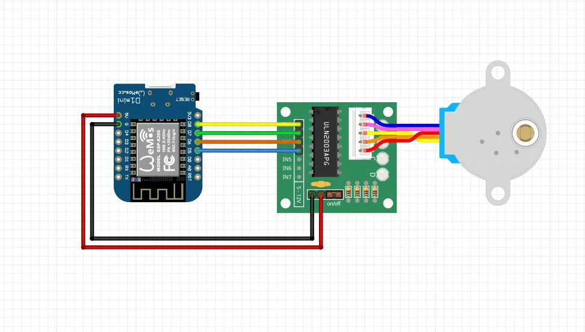
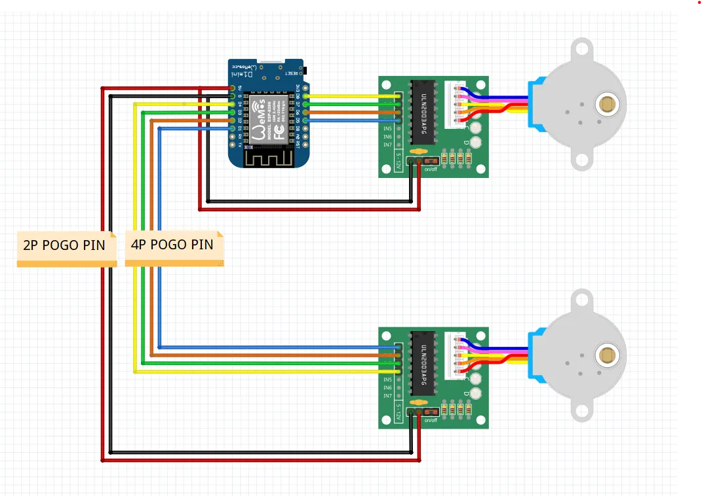

# Watch Winder Assembly Guide

This is a compact watch winder build with wooden slots (3D printable panels) and optional Pogo pin contacts for a modular second winder.

## 1. Quick Overview

The system uses:

1. D1 Mini (ESP8266)
2. 28BYJ-48 stepper + ULN2003 driver
3. Bearings and 3D printed parts
4. Optional Pogo pins for the second modular motor

If the motor does not rotate correctly (vibration, stuttering, unstable direction), the 4 signal wires between D1 Mini and ULN2003 may require a different order depending on motor batch. Reorder the 4 signal wires until rotation is smooth.

## 2. Bill of Materials (BOM)

1. Pogo pins (4P + 2P pair)
   https://s.click.aliexpress.com/e/_c2xJoAxh
2. D1 Mini microcontroller
   https://s.click.aliexpress.com/e/_c2yz2bsB
3. Stepper motor + ULN2003 driver (one set per winder)
   https://s.click.aliexpress.com/e/_c3bp08OR
4. 6001ZZ bearings
   https://s.click.aliexpress.com/e/_c3FSeHun

Notes:

- Single variant needs 1x motor + driver.
- Double variant needs 2x motor + driver.
- Pogo pins are optional, but recommended for modular second-winder contacts.

## 3. Wiring Diagrams (Single and Double)

### Single winder wiring

### Double winder wiring

## 4. Pin Mapping (Firmware)

### Single firmware

File: `winder/winder.ino`

- `IN1 = D5`
- `IN2 = D6`
- `IN3 = D7`
- `IN4 = D8`

### Double firmware

File: `doubleWinder/doubleWinder.ino`

Motor A:

- `IN1_A = D5`
- `IN2_A = D6`
- `IN3_A = D7`
- `IN4_A = D8`

Motor B:

- `IN1_B = D4`
- `IN2_B = D3`
- `IN3_B = D2`
- `IN4_B = D1`

## 5. Step-by-Step Assembly

1. Assemble the mechanical structure and install 6001ZZ bearings.
2. Mount D1 Mini and ULN2003 driver board(s).
3. Connect shared power and GND for all modules.
4. Connect D1 Mini signal wires to ULN2003 according to pin map.
5. Connect the stepper cable to ULN2003.
6. For double variant, wire the second driver/motor pair.
7. If using Pogo pins, verify both 4P (signal) and 2P (power/GND) contact quality.
8. Before closing the case, test rotation at low speed.

## 6. Firmware Selection and Upload

1. For one watch, upload `winder/winder.ino`.
2. For two watches, upload `doubleWinder/doubleWinder.ino`.

Before uploading, configure network constants in firmware:

- `STA_SSID`
- `STA_PASSWORD`
- `ENABLE_AP_FALLBACK`
- `AP_SSID`
- `AP_PASSWORD`
- `STA_CONNECT_TIMEOUT_MS`

Recommended settings:

1. Keep `ENABLE_AP_FALLBACK = true` during initial testing.
2. Use a strong `AP_PASSWORD` (12+ chars).
3. Set `STA_CONNECT_TIMEOUT_MS` to 10000-20000.

## 7. First Boot and Validation

1. Upload firmware.
2. Open Serial Monitor at 115200 and read the assigned IP.
3. Start dashboard from folder `pi-dashboard`.
4. In dashboard, set device URL and click Save Device.
5. Click Refresh Status.
6. Configure parameters and click Start.
7. Verify direction and smooth rotation.

## 8. Dashboard and Timer

- `runMinutes = 0`: unlimited run.
- `runMinutes > 0`: automatic stop when timer expires.
- `Stop` is fail-safe and immediately releases the motor.

## 9. Recommended Starting Setup

Single:

1. `giri = 3`
2. `speed = 2`
3. `delay = 7`

Double:

1. `giri1 = 3`, `speed1 = 2`
2. `giri2 = 3`, `speed2 = 2`
3. `gdelay = 7`

Then fine-tune values based on watch weight and mechanical fit.

## 10. Troubleshooting

1. Motor does not start:
   - check power and shared GND
   - check motor connector on ULN2003
2. Motor vibrates but does not rotate:
   - reorder the 4 signal wires
3. Dashboard reports offline:
   - confirm IP and make sure ESP and dashboard are on same LAN
4. Second motor not working in double mode:
   - verify Motor B pin mapping
   - inspect 2P/4P Pogo contacts

## 11. Video References

Add links to your published videos:

- Part 1: <INSERT_LINK>
- Part 2: <INSERT_LINK>
- Final version: <INSERT_LINK>
